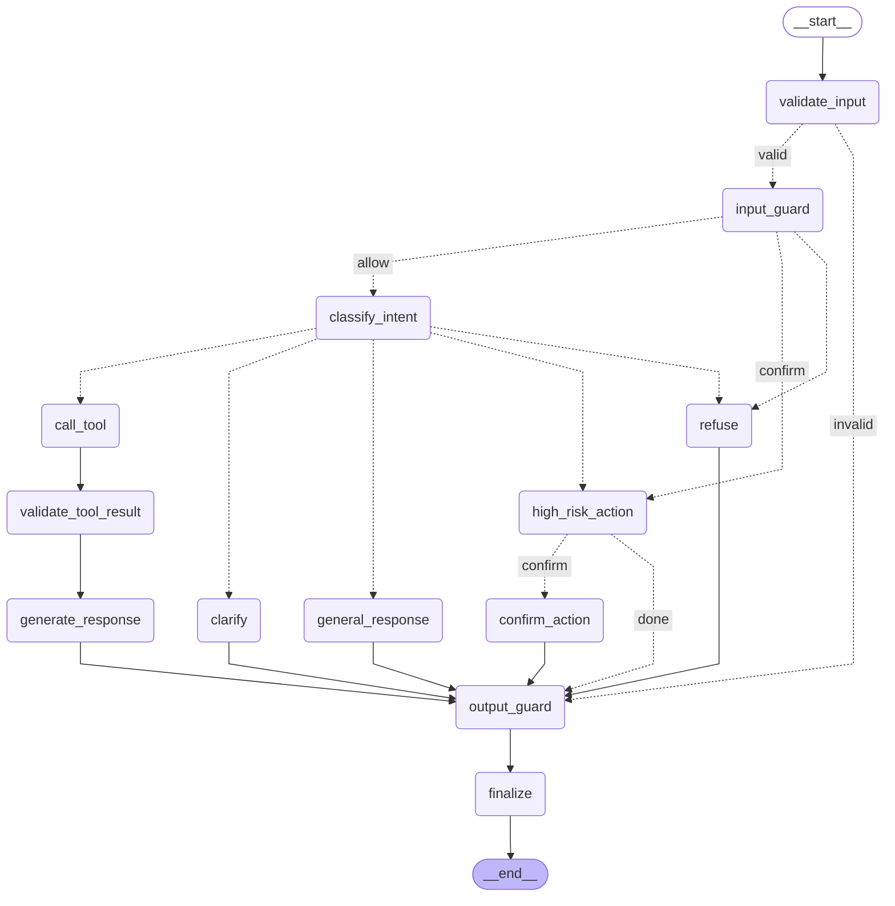

# BankAI agent graph

Generated from the compiled LangGraph by `python -m scripts.export_agent_graph` - do not edit by hand.
Dotted arrows are conditional edges (the routing decisions).

```mermaid
---
config:
  flowchart:
    curve: linear
---
graph TD;
	__start__([<p>__start__</p>]):::first
	validate_input(validate_input)
	input_guard(input_guard)
	classify_intent(classify_intent)
	call_tool(call_tool)
	validate_tool_result(validate_tool_result)
	generate_response(generate_response)
	clarify(clarify)
	general_response(general_response)
	refuse(refuse)
	high_risk_action(high_risk_action)
	confirm_action(confirm_action)
	output_guard(output_guard)
	finalize(finalize)
	__end__([<p>__end__</p>]):::last
	__start__ --> validate_input;
	call_tool --> validate_tool_result;
	clarify --> output_guard;
	classify_intent -.-> call_tool;
	classify_intent -.-> clarify;
	classify_intent -.-> general_response;
	classify_intent -.-> high_risk_action;
	classify_intent -.-> refuse;
	confirm_action --> output_guard;
	general_response --> output_guard;
	generate_response --> output_guard;
	high_risk_action -. &nbsp;confirm&nbsp; .-> confirm_action;
	high_risk_action -. &nbsp;done&nbsp; .-> output_guard;
	input_guard -. &nbsp;allow&nbsp; .-> classify_intent;
	input_guard -. &nbsp;confirm&nbsp; .-> high_risk_action;
	input_guard -.-> refuse;
	output_guard --> finalize;
	refuse --> output_guard;
	validate_input -. &nbsp;valid&nbsp; .-> input_guard;
	validate_input -. &nbsp;invalid&nbsp; .-> output_guard;
	validate_tool_result --> generate_response;
	finalize --> __end__;
	classDef default fill:#f2f0ff,line-height:1.2
	classDef first fill-opacity:0
	classDef last fill:#bfb6fc
```
